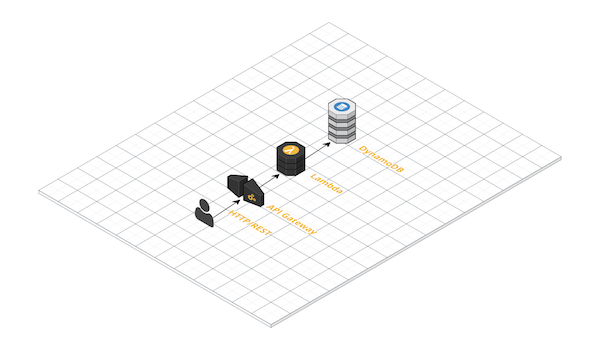

A REST API intendended to be run as a public service to help bootstrap Couchbase distributed database clusters, in other words, to make it easy to stand up a Couchbase cluster from scratch by providing an API for Couchbase nodes to:

- Discover whether they are the first node in the cluster, and need to run cluster-init so other nodes can join them
- If the cluster is already initialized, discover the IP address / hostname of the node they should join.

## Sequence diagram

Here's how the interaction between [bootstrap scripts](https://github.com/couchbase/sync-gateway-ami/blob/master/src/cbbootstrap.py) running on the Couchbase nodes would interact with cbbootstrap running externally:


## Deployment Architecture



## Sample Use

See [cbbootstrap.py](https://github.com/couchbase/sync-gateway-ami/blob/master/src/cbbootstrap.py) -- this is intended to be called from a `user-data.sh` script on EC2 instance launch, but can be used in other scenarios.

## Backstory

Needed for the dynamic and automated [sync-gateway-ami](https://github.com/couchbase/sync-gateway-ami) project to be able to start a CloudFormation and have the Couchbase Server cluster initialize itself based on parameters.

This could also be useful when trying to run Couchbase in container orchestration platforms like Kubernetes or Docker Swarm.

## REST API Definition

See [hosted swaggerhub API docs](https://swaggerhub.com/apis/tleyden/CBBootstrap/1.0.0) or raw [swagger.yaml](goa/swagger/swagger.yaml) 

## Create DynamoDB database

Create a table named `cb-bootstrap`

## Deploy to AWS Lambda

Get the code:

```
$ go get github.com/couchbase/cbbootstrap
```

Package the lambda function 

```
$ cd $GOPATH/src/github.com/couchbase/cbbootstrap
$ wget -O Makefile https://github.com/eawsy/aws-lambda-go-shim/raw/master/src/Makefile.example
$ make
```

Deploy cloudformation with lambda function

```
$ aws cloudformation package \
  --template-file aws_serverless_application_model.yaml  \
  --output-template-file aws_serverless_application_model.out.yaml \
  --s3-bucket cf-templates-1m70kn8ou9eql-us-east-1
$ aws cloudformation deploy \
  --template-file aws_serverless_application_model.out.yaml \
  --capabilities CAPABILITY_IAM \
  --stack-name CBBootstrapExperiment \
  --region us-east-1
```

Get REST API endpoint

```
$ aws cloudformation describe-stacks \
  --stack-name CBBootstrapExperiment \
  --region us-east-1 | grep -i OutputValue

"OutputValue": "https://5e61vqxs5f.execute-api.us-east-1.amazonaws.com/Prod"
```

Test endpoint

```
$ curl https://5e61vqxs5f.execute-api.us-east-1.amazonaws.com/Prod
```


Call API

```
$ curl -X POST \
    -d '{"cluster_id": "mycluster", "node_ip_addr_or_hostname": "mynode_ip"}' \
    https://5e61vqxs5f.execute-api.us-east-1.amazonaws.com/Prod/cluster
```

## Related work

* [Using DNS SRV records for discovering Couchbase nodes](https://developer.couchbase.com/documentation/server/current/sdk/java/managing-connections.html#story-h2-6) + [related blog post](http://nitschinger.at/Bootstrapping-from-DNS-SRV-records-in-Java/)
